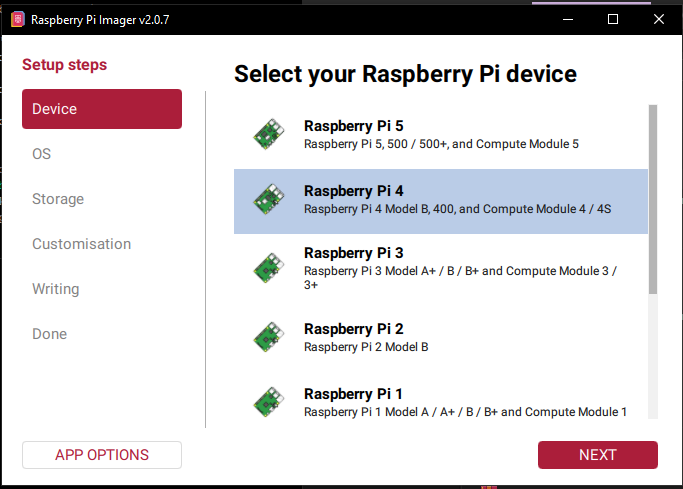

# Raspberry Pi 4 Model B



While this setup works, there is other solutions that are less setup involved and less vodoo shit.

I will post more ways to spoof ARP in the near future.


#### Download link ([https://www.raspberrypi.com/software/](https://www.raspberrypi.com/software/))

Flash your MicroSD card using raspberrypi OS, I am using Pi 4 Model B, arm64 version.

### How to flash the MicroSD

<figure><figcaption></figcaption></figure>

<figure><figcaption></figcaption></figure>

<figure><figcaption></figcaption></figure>

<figure><figcaption></figcaption></figure>

<figure><figcaption></figcaption></figure>

<figure><figcaption></figcaption></figure>

### If you are using WiFi ⇒ RJ45(Ethernet Adapter)

<figure><figcaption></figcaption></figure>

If not just leave empty, your SSID must be your routers WiFi Name and you must make sure to press "SECURE NETWORK" to see the password fields.

<figure><figcaption></figcaption></figure>

<figure><figcaption></figcaption></figure>

<figure><figcaption></figcaption></figure>

After finish writing now you need to plug in the MicroSD card to your Raspberry Pi.

<mark style="color:red;">I have not fully finished testing this setup but currently I am powering my Raspberry Pi 4 connected through USB port on my gaming PC, I have not seen a single unique identifiable serial number on my PC from the connection.</mark>\
\ <mark style="color:red;">However might be worth mentioning incase you are paranoid, you should just order a power cable to your raspberry pi model 4.</mark>

***

### Working example

This assumes you are using the RJ45 (Ethernet port) for sharing the network and the WiFi for the PI to have network.

* Connect to the Device using (Putty) SSH
* If your Raspberry Pi is connected to a router you can login to the admin panel and find the IPv4 its using in the device list: (image preview below)

<figure><figcaption></figcaption></figure>

* Download Putty ([https://the.earth.li/\~sgtatham/putty/latest/w64/putty-64bit-0.83-installer.msi](https://the.earth.li/~sgtatham/putty/latest/w64/putty-64bit-0.83-installer.msi))
* Install Putty, is not rocket science.
* In putty connect to your raspberry pi

#### Update machine

*   Run commands

    ```sh
    sudo su
    ```

    ```sh
    apt update && apt upgrade -y
    ```
*   Run command&#x20;

    ```sh
    ip link show
    ```

<figure><figcaption></figcaption></figure>

So in my setup I am going to use the `wlan0` => `eth0`

<mark style="color:purple;">You can also use this method for 2x</mark> <mark style="color:red;">`RJ45(Ethernet Ports)`</mark> <mark style="color:purple;">but it requires you to use a</mark> <mark style="color:$danger;">`USB Ethernet adapter`</mark> <mark style="color:purple;">but you need to reverse the order on how you are doing it.</mark>

<mark style="color:purple;">If you are using a</mark> <mark style="color:$danger;">**USB Ethernet Adapter**</mark> <mark style="color:purple;">**the internet**</mark> <mark style="color:purple;"></mark><mark style="color:purple;">must be coming from the</mark> <mark style="color:$danger;">Ethernet adapter</mark> <mark style="color:purple;">and be shared of the RJ45 built in port on the Raspberry Pi, otherwise it will not allow you to use internet cause the USB Ethernet adapter port will be sleeping.</mark>

### Create config (WiFi config)

*   Run command&#x20;

    ```sh
    sudo nano /etc/systemd/network/10-wlan0.network
    ```

    if you want to make it `USB Ethernet adapter` ⇒ RJ45 share you rename this to `10-eth1.network`
*   Paste this:

    ```sh
    [Match]
    Name=wlan0

    [Network]
    DHCP=yes
    ```

    if you want to make it `USB Ethernet adapter` ⇒ RJ45 share you rename this to `Name=eth1`
* CTRL + X to save the file

### Create config (network sharing)

*   Run command&#x20;

    ```sh
    sudo nano /etc/systemd/network/20-eth0.network
    ```
*   Paste this:&#x20;

    ```sh
    [Match]
    Name=eth0

    [Link]
    MACAddress=02:00:00:00:00:01

    [Network]
    Address=192.168.50.1/24
    ```
*   Run this:&#x20;

    ```sh
    sudo systemctl enable systemd-networkd
    ```

    ```sh
    sudo systemctl restart systemd-networkd
    ```

### Enable IP forwarding globally

*   Run command&#x20;

    ```shell
    sudo nano /etc/sysctl.d/99-router.conf
    ```
*   Paste this:&#x20;

    ```sh
    net.ipv4.ip_forward=1
    ```
*   Apply changes:&#x20;

    ```shell
    sudo sysctl --system
    ```

#### NAT Internet Sharing

*   Run command&#x20;

    ```sh
    sudo apt update && sudo apt install nftables -y
    ```
*   Edit config&#x20;

    ```sh
    sudo nano /etc/nftables.conf
    ```
*   Replace with this:

    ```sh
    #!/usr/sbin/nft -f

    flush ruleset

    table ip nat {
     chain postrouting {
      type nat hook postrouting priority 100;
      oifname "wlan0" masquerade
     }
    }

    table ip filter {
     chain forward {
      type filter hook forward priority 0;
      policy drop;

      iifname "eth0" oifname "wlan0" accept
      iifname "wlan0" oifname "eth0" ct state related,established accept
     }
    }
    ```

    if you want to make it `USB Ethernet adapter` ⇒ RJ45 sharing you rename `wlan0` to `eth1`
*   Enable:&#x20;

    ```sh
    sudo systemctl enable nftables
    ```

    ```sh
    sudo systemctl restart nftables
    ```
*   Run this:

    ```sh
    sudo reboot
    ```

***

### Windows PC (setup)

Plug your PC into the RJ45 port on the Pi

```apex
IP:      192.168.50.10
Mask:    255.255.255.0
Gateway: 192.168.50.1
DNS:     1.1.1.1
```

<figure><figcaption></figcaption></figure>

<figure><figcaption></figcaption></figure>

<figure><figcaption></figcaption></figure>

<figure><figcaption></figcaption></figure>

<figure><figcaption></figcaption></figure>

### Result of ARP table:

<figure><figcaption></figcaption></figure>

***

### If you have issues

If you cannot connect to the internet or the internet connection is dropping after a while, do not worry.

* Open Putty
* Use IP 192.168.50.1 to connect to the server
*   Write these commands:

    ```sh
    sudo ethtool -K eth0 gro off gso off tso off rx off tx off
    ```

    ```sh
    sudo ethtool -K wlan0 gro off gso off tso off rx off tx off
    ```

    ```sh
    sudo systemctl restart nftables
    ```

    ```sh
    sudo systemctl restart NetworkManager
    ```


* And the connection should start working again
