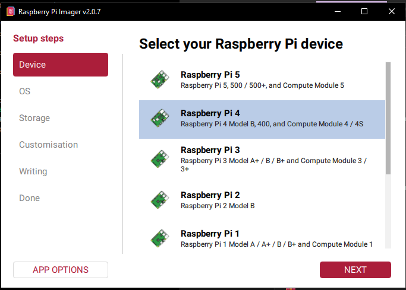

# Raspberry Pi 4 Model B


While this setup works, there is other solutions that are less setup involved and less vodoo shit.

I will post more ways to spoof ARP in the near future.


#### Download link ([https://www.raspberrypi.com/software/](https://www.raspberrypi.com/software/))

Flash your MicroSD card using raspberrypi OS, I am using Pi 4 Model B, arm64 version.

### How to flash the MicroSD

<figure><figcaption></figcaption></figure>

<figure><figcaption></figcaption></figure>

<figure><figcaption></figcaption></figure>

<figure><figcaption></figcaption></figure>

<figure><figcaption></figcaption></figure>

<figure><figcaption></figcaption></figure>

### If you are using WiFi ⇒ RJ45(Ethernet Adapter)

<figure><figcaption></figcaption></figure>

If not just leave empty, your SSID must be your routers WiFi Name and you must make sure to press "SECURE NETWORK" to see the password fields.

<figure><figcaption></figcaption></figure>

<figure><figcaption></figcaption></figure>

<figure><figcaption></figcaption></figure>

After finish writing now you need to plug in the MicroSD card to your Raspberry Pi.

<mark style="color:red;">I have not fully finished testing this setup but currently I am powering my Raspberry Pi 4 connected through USB port on my gaming PC, I have not seen a single unique identifiable serial number on my PC from the connection.</mark>\
\ <mark style="color:red;">However might be worth mentioning incase you are paranoid, you should just order a power cable to your raspberry pi model 4.</mark>

***

### Working example

This example assumes:

```
WiFi → Raspberry Pi → RJ45 → PC
```

The Raspberry Pi uses:

```
wlan0 = Internet / upstream
eth0  = LAN / downstream
```

The network will look like:

```
                 Internet
                    │
               WiFi Router
               192.168.0.1
                    │
                 wlan0
              192.168.0.x
                    │
             Raspberry Pi
                    │
                  eth0
              192.168.50.1
                    │
                  RJ45
                    │
                    PC
              192.168.50.x
```

You can also use two Ethernet interfaces.

For example:

```
eth1 = Internet / upstream
eth0 = LAN / downstream
```

If you use a USB Ethernet adapter, the interface name may be `eth1`, `enx...`, or something else. Always check with:

```
ip link show
```

and substitute the correct interface name throughout the configuration.

***

### Connect to the Raspberry Pi

* Connect to the Device using (Putty) SSH
* If your Raspberry Pi is connected to a router you can login to the admin panel and find the IPv4 its using in the device list: (image preview below)

<figure><figcaption></figcaption></figure>

* Download Putty ([https://the.earth.li/\~sgtatham/putty/latest/w64/putty-64bit-0.83-installer.msi](https://the.earth.li/~sgtatham/putty/latest/w64/putty-64bit-0.83-installer.msi))
* Install Putty, is not rocket science.
* In putty connect to your raspberry pi

## Update the machine

Run:

```
sudo -i
```

Then:

```
apt update && apt upgrade -y
```

Identify your network interfaces:

```
ip link show
```

<figure><figcaption></figcaption></figure>

For this example:

```
wlan0 → Internet
eth0  → PC
```

***

## Configure the Network

> **Important:** This guide uses **Netplan + NetworkManager**.
>
> Do not configure the same interfaces using `systemd-networkd` at the same time. Running multiple network managers against the same interface can result in interfaces being brought up without their expected IP configuration.

### Create the Netplan configuration

First check your existing Netplan files:

```
ls -la /etc/netplan/
```

Create a dedicated router configuration:

```
nano /etc/netplan/01-router.yaml
```

Paste:

```
network:
  version: 2
  renderer: NetworkManager

  ethernets:
    eth0:
      dhcp4: false
      dhcp6: false
      addresses:
        - 192.168.50.1/24
      macaddress: 02:00:00:00:00:01
```

#### What this does

The Ethernet interface receives:

```
IP: 192.168.50.1
Subnet: 255.255.255.0
MAC: 02:00:00:00:00:01
```

The custom MAC address is retained from the original configuration.

There is intentionally **no gateway configured on `eth0`**.

The gateway belongs to the upstream WiFi connection.Configure the WiFi connection

The WiFi interface should remain managed by NetworkManager.

Check:

```
nmcli device status
```

You should see something similar to:

```
DEVICE   TYPE      STATE      CONNECTION
wlan0    wifi      connected  Your-WiFi
eth0     ethernet  connected  netplan-eth0
```

The WiFi interface should obtain its address from your existing router using DHCP.

For example:

```
wlan0 → 192.168.0.204
Gateway → 192.168.0.1
```

You do not need to manually create a `/etc/systemd/network/10-wlan0.network` file.

***

### Apply the network configuration

Validate the Netplan configuration:

```
netplan generate
```

If there are no errors:

```
netplan apply
```

Check the result:

```
ip -br addr
```

You should have something similar to:

```
eth0   UP   192.168.50.1/24
wlan0  UP   192.168.0.x/24
```

Verify the custom MAC:

```
ip link show eth0
```

You should see:

```
link/ether 02:00:00:00:00:01
```

Check the routing table:

```
ip route
```

You should have:

```
192.168.50.0/24 dev eth0
192.168.0.0/24 dev wlan0
default via 192.168.0.1 dev wlan0
```

***

## Enable IP forwarding globally

Create:

```
nano /etc/sysctl.d/99-router.conf
```

Add:

```
net.ipv4.ip_forward=1
```

Apply the configuration:

```
sysctl --system
```

Verify:

```
sysctl net.ipv4.ip_forward
```

Expected:

```
net.ipv4.ip_forward = 1
```

***

## NAT Internet Sharing

Install nftables:

```
apt update && apt install nftables -y
```

Edit:

```
nano /etc/nftables.conf
```

Use:

```
#!/usr/sbin/nft -f

flush ruleset

table ip nat {
    chain postrouting {
        type nat hook postrouting priority 100;
        oifname "wlan0" masquerade
    }
}

table ip filter {
    chain forward {
        type filter hook forward priority 0;
        policy drop;

        iifname "eth0" oifname "wlan0" accept
        iifname "wlan0" oifname "eth0" ct state related,established accept
    }
}
```

If your upstream Internet interface is different, replace:

```
wlan0
```

with the appropriate interface.

If your downstream LAN interface is different, replace:

```
eth0
```

with the appropriate interface.

Enable nftables:

```
systemctl enable nftables
```

Restart:

```
systemctl restart nftables
```

Verify:

```
nft list ruleset
```

***

## Disable WiFi Power Saving

Check the current state:

```
iw dev wlan0 get power_save
```

Temporarily disable power saving:

```
iw dev wlan0 set power_save off
```

For a persistent configuration with NetworkManager, configure the WiFi connection directly.

First find the connection name:

```
nmcli connection show
```

Then:

```
nmcli connection modify "YOUR-WIFI-NAME" 802-11-wireless.powersave 2
```

Reconnect:

```
nmcli connection down "YOUR-WIFI-NAME"
nmcli connection up "YOUR-WIFI-NAME"
```

Verify:

```
iw dev wlan0 get power_save
```

Expected:

```
Power save: off
```

***

## DHCP Server

Install dnsmasq:

```
apt install dnsmasq -y
```

Create the router configuration:

```
nano /etc/dnsmasq.d/router.conf
```

Add:

```
interface=eth0

dhcp-range=192.168.50.100,192.168.50.200,12h

dhcp-option=3,192.168.50.1
dhcp-option=6,1.1.1.1,1.0.0.1
```

This provides DHCP addresses to devices connected to the Raspberry Pi's LAN interface.

Restart dnsmasq:

```
systemctl restart dnsmasq
```

Enable it at boot:

```
systemctl enable dnsmasq
```

Check its status:

```
systemctl status dnsmasq
```

***

## Final Verification

Before rebooting, check the interfaces:

```
ip -br addr
```

Expected:

```
eth0   UP   192.168.50.1/24
wlan0  UP   192.168.0.x/24
```

Check routing:

```
ip route
```

Check forwarding:

```
sysctl net.ipv4.ip_forward
```

Check the custom MAC:

```
ip link show eth0
```

You should see:

```
link/ether 02:00:00:00:00:01
```

At this point, connect your PC to the Raspberry Pi's Ethernet port.

The PC should receive an address in:

```
192.168.50.100 – 192.168.50.200
```

The PC's gateway should be:

```
192.168.50.1
```

### Result of ARP table:

<figure><figcaption></figcaption></figure>

***

## Reboot

Finally:

```
reboot
```

After the Raspberry Pi comes back online, verify:

```
ip -br addr
```

The important part is that `eth0` should automatically have:

```
192.168.50.1/24
```

You should **not** need to manually run:

```
ip addr add 192.168.50.1/24 dev eth0
```

***

## If You Have Issues

If the PC cannot access the Internet, first determine where the failure occurs rather than immediately disabling network offloading.

From the PC, test:

```
192.168.50.1
```

Then:

```
192.168.0.1
```

Then:

```
1.1.1.1
```

Then:

```
google.com
```

This helps determine whether the problem is:

```
PC → Raspberry Pi
```

```
Raspberry Pi → Router
```

```
NAT/forwarding
```

or:

```
DNS
```

On the Raspberry Pi, check:

```
ip -br addr
ip route
```

Then:

```
sysctl net.ipv4.ip_forward
```

Check nftables:

```
nft list ruleset
```

Check dnsmasq:

```
systemctl status dnsmasq
```

Check the WiFi connection:

```
iw dev wlan0 link
```

Check the kernel/network logs:

```
journalctl -k -n 100 --no-pager
```

#### Advanced troubleshooting

If packet handling appears to be failing under load, you can temporarily test with hardware/software offloading disabled:

```
sudo ethtool -K eth0 gro off gso off tso off
sudo ethtool -K wlan0 gro off gso off tso off
```

Then test the connection again.

**Do not treat this as a default configuration.** Offload settings can affect performance and CPU usage, and they should only be changed if testing indicates an offload/driver-related problem.

If the problem disappears after disabling offloads, investigate the driver/kernel/network adapter before making those settings permanent.

You can restore the normal settings with:

```
sudo ethtool -K eth0 gro on gso on tso on
sudo ethtool -K wlan0 gro on gso on tso on
```

If NetworkManager was restarted during troubleshooting:

```
sudo systemctl restart NetworkManager
```

***

### Result

Your final setup should be:

```
                 INTERNET
                     │
                 WiFi Router
                  192.168.0.1
                     │
                   wlan0
                DHCP / 192.168.0.x
                     │
              Raspberry Pi 4
                     │
                   eth0
             MAC: 02:00:00:00:00:01
               192.168.50.1/24
                     │
                    RJ45
                     │
                    PC
              192.168.50.x
```

The Raspberry Pi provides:

* WiFi → Ethernet routing
* IPv4 forwarding
* nftables NAT
* DHCP through dnsmasq
* Static `192.168.50.1/24` LAN addressing
* Persistent custom MAC address on `eth0`
* NetworkManager/Netplan-based configuration
* WiFi power saving disabled
