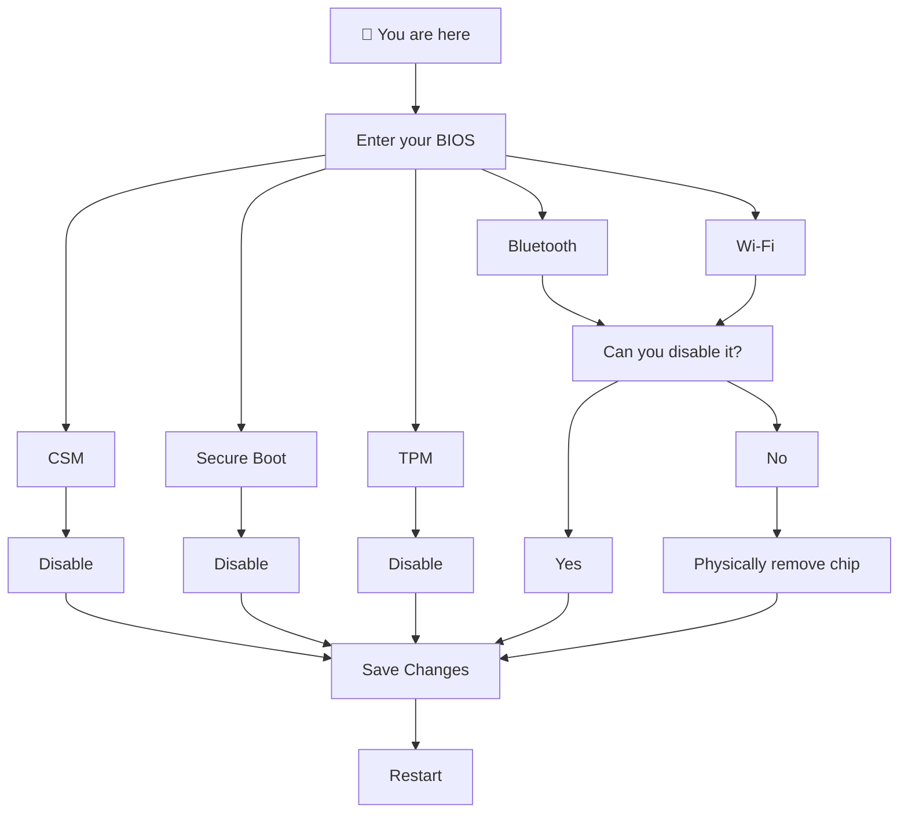
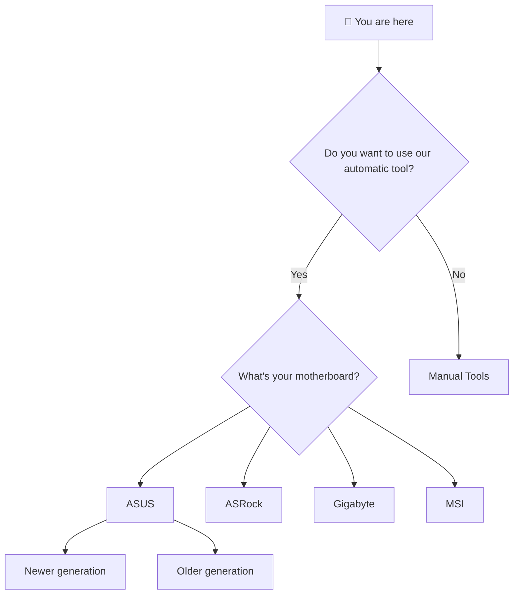
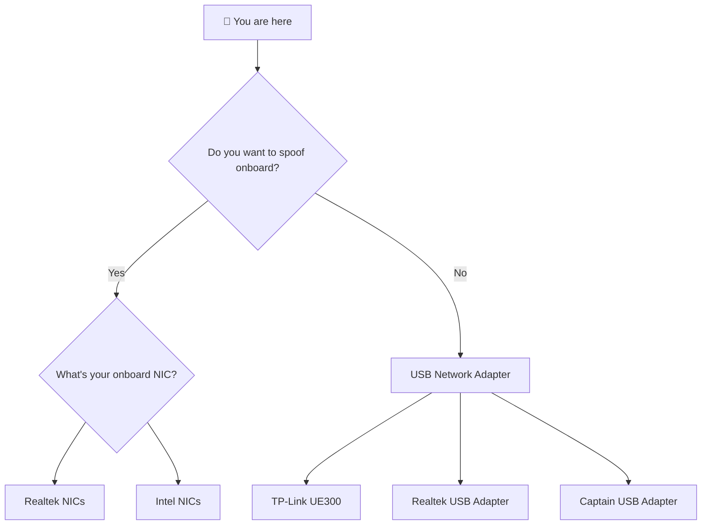
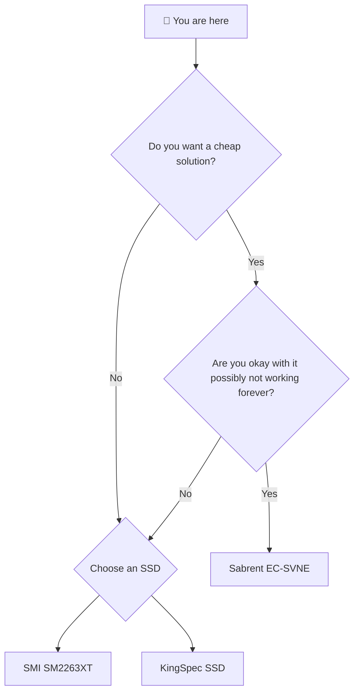
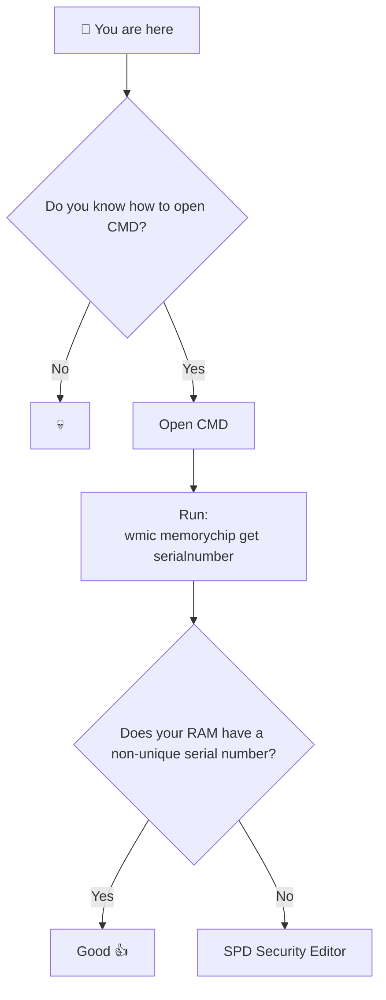
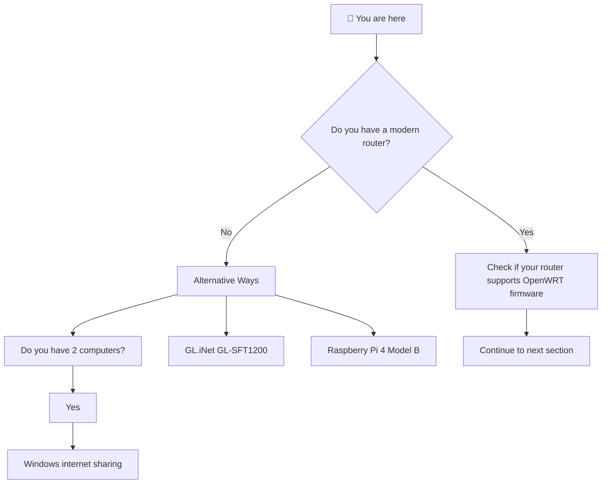
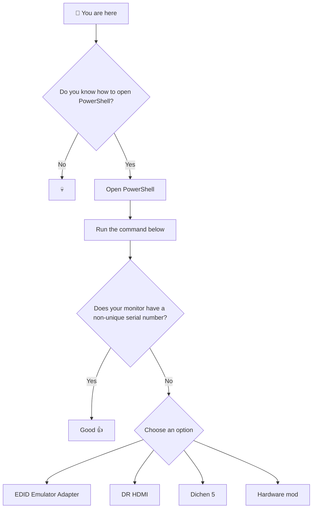

# Spoof order


This guide can be overwhelming, but I hope this will help people


## Bios



***

## USB Serials


Not confirmed if this cause issues, but you might as well replace USB devices with serials




Replace anything that has serial, you can find part list here:



***

## Graphic card


Not confirmed if this cause issues


<mark style="color:$danger;">NVIDIA Graphic cards have serial numbers</mark> that at the moment is not perm-spoofable.

I highly recommend you to get a <mark style="color:green;">AMD graphic card from Gigabyte</mark>.

***

## Motherboard spoofing



***

## Mac spoofing



***

## Disk spoofing



***

## Ram spoofing



```bash
wmic memorychip get serialnumber
```

***

## Arp spoofing



***

## Monitor spoofing



```powershell
    Get-CimInstance -Namespace root\wmi -ClassName WmiMonitorID | ForEach-Object {
    [PSCustomObject]@{
        Manufacturer = ($_.ManufacturerName -ne 0 | ForEach-Object {[char]$_}) -join ""
        Model        = ($_.UserFriendlyName -ne 0 | ForEach-Object {[char]$_}) -join ""
        SerialNumber = ($_.SerialNumberID -ne 0 | ForEach-Object {[char]$_}) -join ""
        }
    }
```

***

## Clear NVRAM



***

## Reinstall windows



***

## Misc stuff

> You might wonder why I said disable CSM / Secure boot?

### Yes?

> Does this mean our spoofer does not support CSM / Secure boot?

### No

### The reasoning we are disabling CSM is to avoid issues when spoofing your motherboard with DMI edit or AMIDEWINx64

### The reasoning we are disabling Secure boot is to allow you to use our tool for editing NVRAM, Efivars from [efivars.md](../nvram-spoofing/efivars.md "mention")

After you have reinstalled Windows you can enable all security features if you want again.

* Secure boot
* CSM
* IOMMU
* Virtualization

<mark style="color:$danger;">**Just do not enable TPM if your fTPM key was banned before**</mark>**&#x20;**<mark style="color:$primary;">**because if you do that then you have to redo clearing NVRAM and reinstalling Windows again.**</mark>

<mark style="color:$danger;">**And remember that**</mark> [step-3.md](step-3.md "mention") <mark style="color:$danger;">always applies</mark>

<mark style="color:$primary;">**Right now I really recommend people using dTPM (Discrete trusted platform module) instead of spoofing their fTPM.**</mark>



Always remember that you can join our discord for help, just do not waste our time.

> Read <mark style="color:pink;">**#create-a-ticket**</mark> before opening a ticket.

And avoid asking us questions like

* Can you recommend me a spoofer
