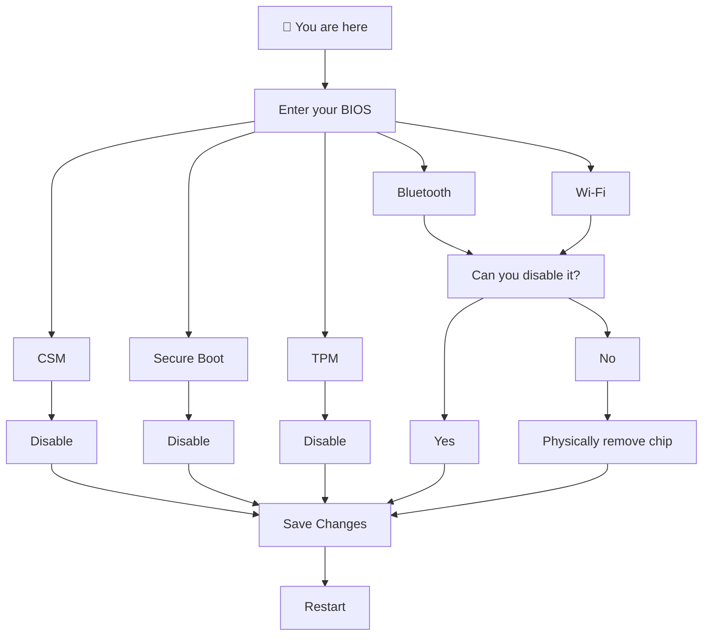
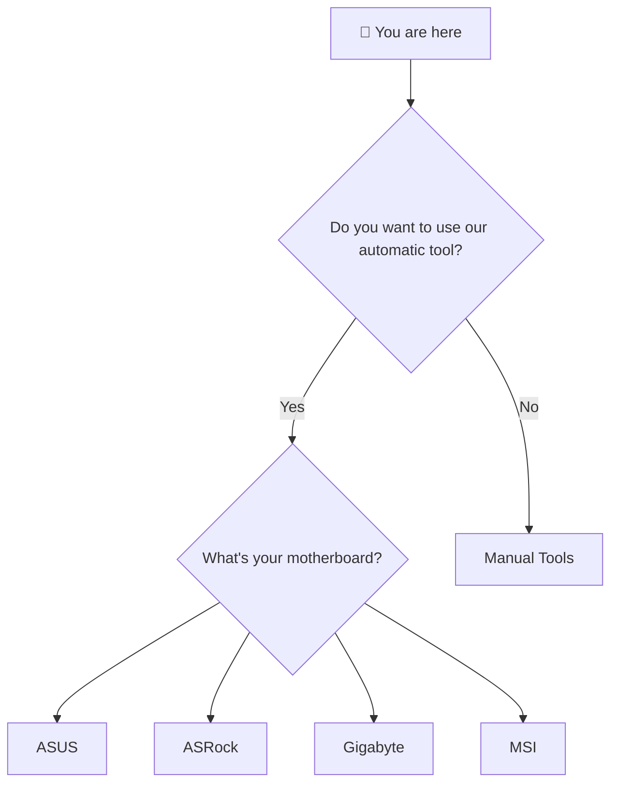
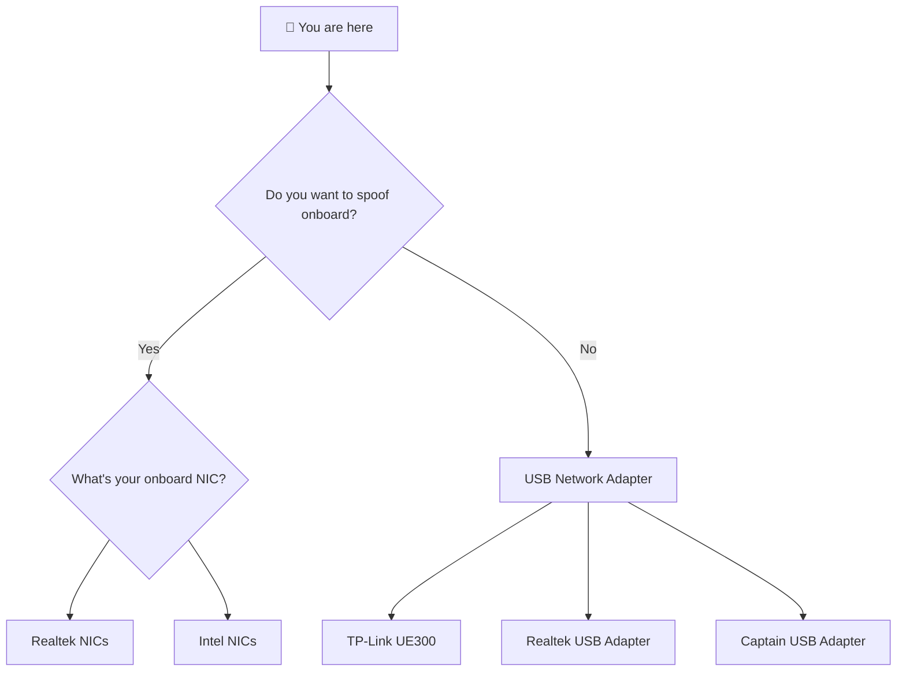
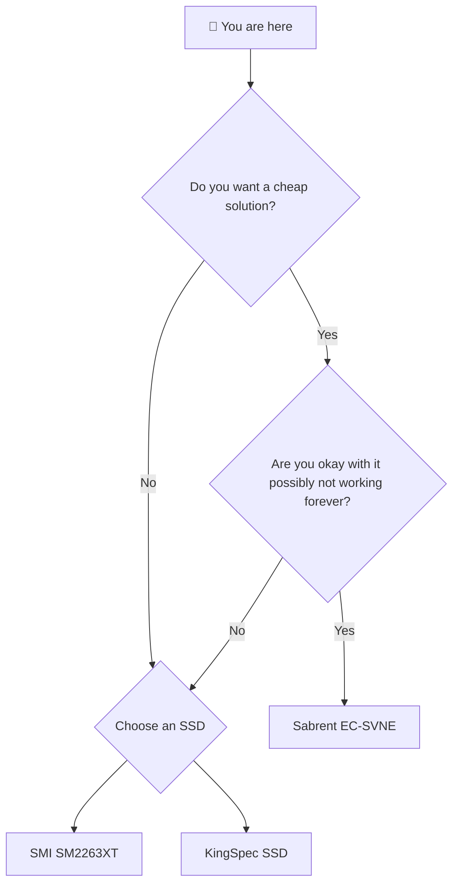
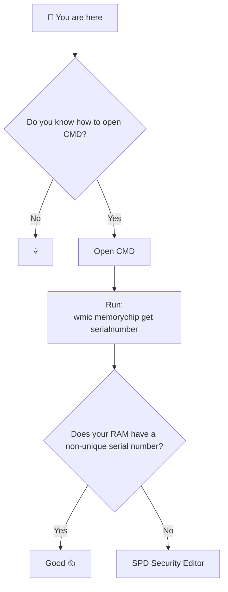
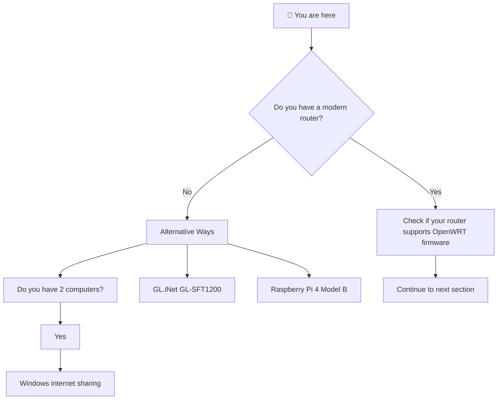
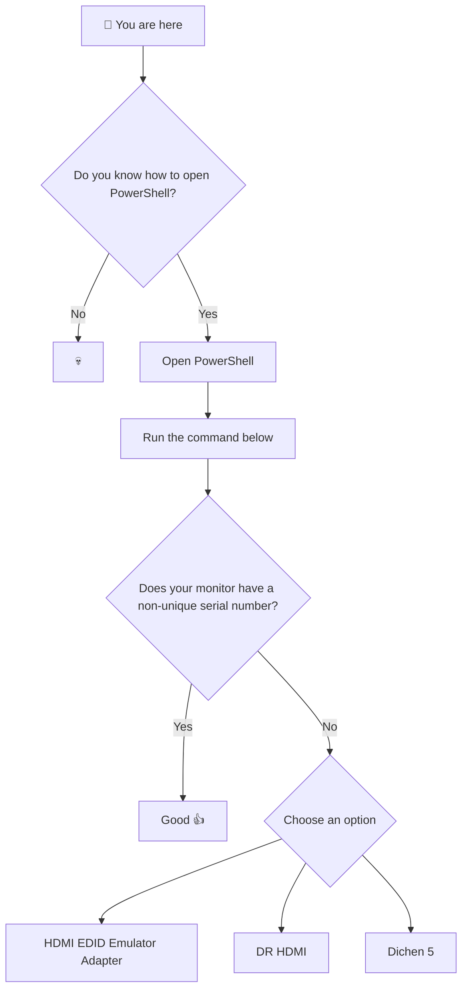

# Spoof order


This guide can be overwhelming, but I hope this will help people


## 1. Bios



***

## 2. Motherboard spoofing



***

## 3. Mac spoofing



***

## 4. Disk spoofing



***

## 5. Ram spoofing



***

## 6. Arp spoofing



***

## 7. Monitor spoofing



```powershell
    Get-CimInstance -Namespace root\wmi -ClassName WmiMonitorID | ForEach-Object {
    [PSCustomObject]@{
        Manufacturer = ($_.ManufacturerName -ne 0 | ForEach-Object {[char]$_}) -join ""
        Model        = ($_.UserFriendlyName -ne 0 | ForEach-Object {[char]$_}) -join ""
        SerialNumber = ($_.SerialNumberID -ne 0 | ForEach-Object {[char]$_}) -join ""
        }
    }
```

***
