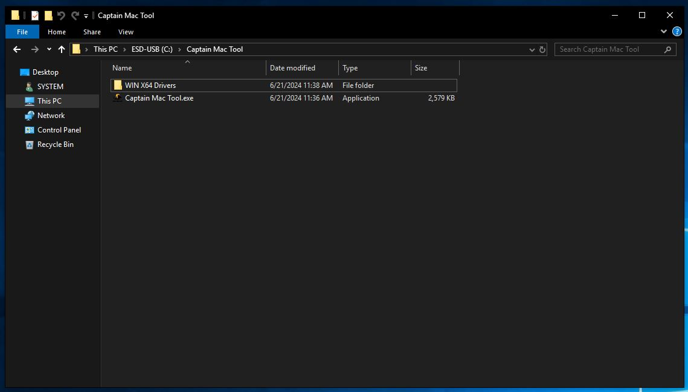
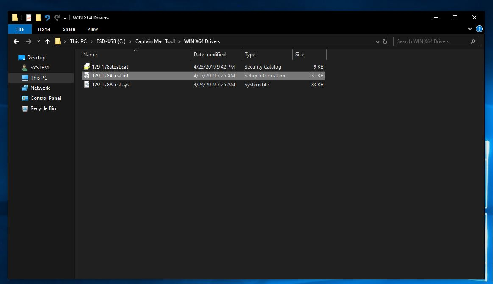
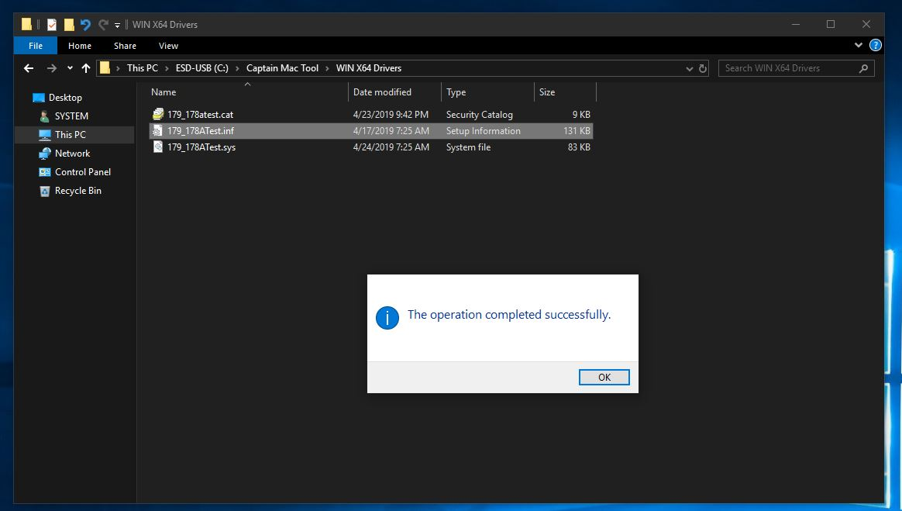
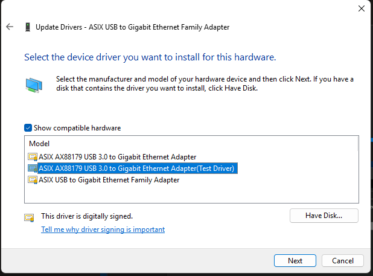
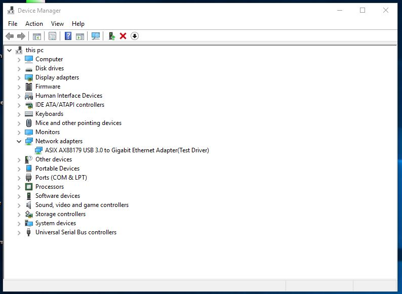
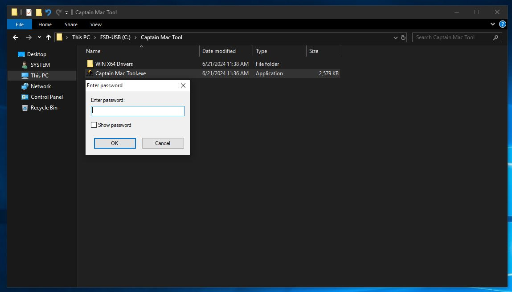
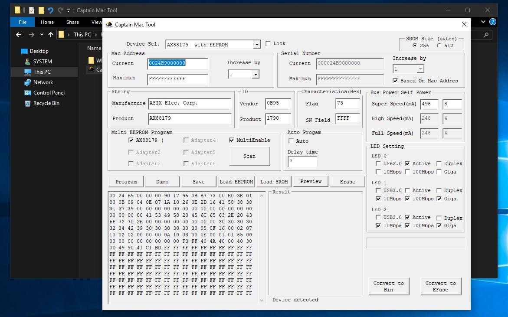
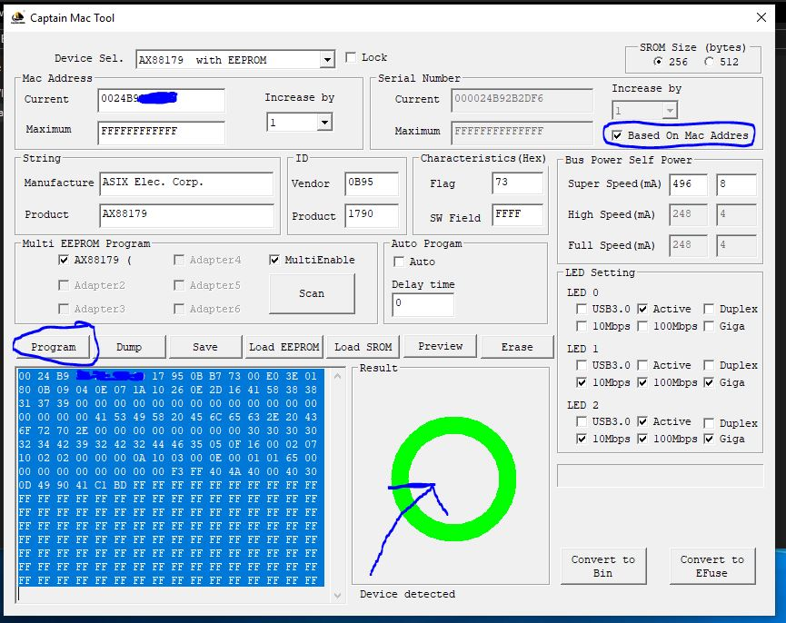

# Captain USB adapter

Tool can be found [here](https://github.com/GoofyNest/HardwareSpoofing/releases/tag/captain)

***

### Step 1:

Download and extract the tool either from Captain DMA discord or on our [Github](https://github.com/GoofyNest/HardwareSpoofing/releases/tag/captain), password for executable is `captaindma`

<figure><figcaption></figcaption></figure>

### Step 2:

Head to the `WIN X64 Drivers` folder and locate the file `179_178ATest.inf`, right click it and hit Install.

<figure><figcaption></figcaption></figure>

<figure><figcaption></figcaption></figure>

### Step 3:&#x20;

Open device manager on your system by typing `devmgmt.msc`, in search. Located `Network Adapters`, Locate `ASIX USB to Gigabit Ethernet Family Adapter`,

Right click ⇒ Properties ⇒ Driver ⇒ Update Driver ⇒ Browse my computer for Drivers ⇒ Let me pick from from a list

<figure><figcaption></figcaption></figure>

Select the (Test Driver) and hit Next, if done correctly it should now show up as:

<figure><figcaption></figcaption></figure>

### Step 4:

Open the Captain Mac Tool.exe

<figure><figcaption></figcaption></figure>

Password is `captaindma`

### Step 5:

Click the option saying **"Based On Mac Address"**

Change the Mac Address Current, the only thing that is important is that the start remains the same.

**00:24:B9 - This first 3 bytes is the manufacturer mac**

`Wuhan Higheasy Electronic Technology Development Co.Ltd`

The last remaining bytes you can randomize with ChatGPT or some online randomizer

[https://dnschecker.org/mac-address-generator.php](https://dnschecker.org/mac-address-generator.php)

<figure><figcaption></figcaption></figure>

When done hit the Program button

<figure><figcaption></figcaption></figure>

Re-plug your USB Ethernet Adapter and make sure your MAC has changed by writing&#x20;

`Ipconfig /all`

in cmd, if the mac is different its now spoofed.
