# Reinstall

### Operating system


You must have a working USB device minimum of 8GB of size


<mark style="background-color:$primary;">These ones are highly recommended to use</mark>

* [Windows 10](https://www.microsoft.com/en-us/software-download/windows10?msockid=3296b6ab2f5264701651a0622eaa6532)&#x20;
* [Windows 11](https://learn.microsoft.com/en-us/answers/questions/3895752/where-can-i-download-windows-11-iso)

***

### Rufus

1. [Open the **Rufus** website](https://rufus.ie/).
2. Click the link to download the latest version under the “Download” section.
3. Double-click the **Rufus** executable file to launch the tool.
4. Select the flash drive to create a Windows 10/11 bootable USB drive in the “Device” section.
5.  Click the **Select** button. 

    <figure><figcaption></figcaption></figure>
6. Select the **Windows 10/11 ISO** file.
7. Click **Start**
8.  Check the **“Remove requirement for 4GB+ RAM, Secure Boot and TPM 2.0”** option to install version 25H2 on unsupported hardware.\
     

    <figure><figcaption></figcaption></figure>
9.  Check the **“Remove requirement for an online Microsoft account”** 

    <figure><figcaption></figcaption></figure>
10. Select the **“Create a local account with username”** option, then specify the account name to install the operating system with a local account.\
    `user`
11. Check the **“Set regional options to the same values as this user’s”** option to use the current language as the default for new installations.
12. Check the **“Disable data collection”** option to prevent Microsoft from collecting certain data.
13. Check the **“Disable BitLocker automatic device encryption”** option.
14. Click the **OK** button.

***

### Finding your RAID driver

Google your motherboard manufacturer + motherboard product name on google

Example: Gigabyte B550 AORUS ELITE V2

<figure>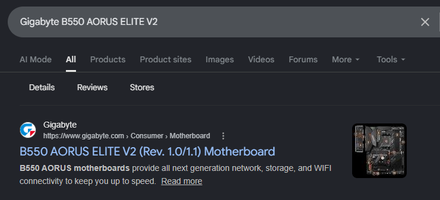<figcaption></figcaption></figure>

Go to Support ⇒ Driver

<figure><figcaption></figcaption></figure>

Select your Windows version if the website has it.

Search for Raid Driver

<figure>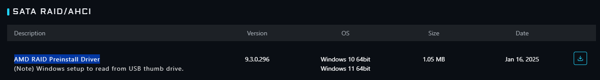<figcaption></figcaption></figure>

Download and extract this to your freshly made WIndows USB in a folder called `Raid`

***

### Destroy raid array

<mark style="background-color:violet;">**Only for AMD**</mark>\ <mark style="background-color:violet;">**Only for specific motherboards**</mark>\ <mark style="background-color:violet;">**Check your Manufacturer website if your motherboard supports NVME raid 0**</mark>


Skip if you are using a spoofable NVME


1. Restart pc
2. Press your BIOS key, if you dont know it google your manufacturer.
3.  Press F2 for **Advanced mode**

    <figure>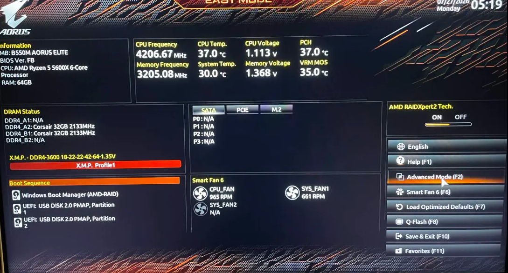<figcaption></figcaption></figure>
4.  Click **Settings**

    <figure>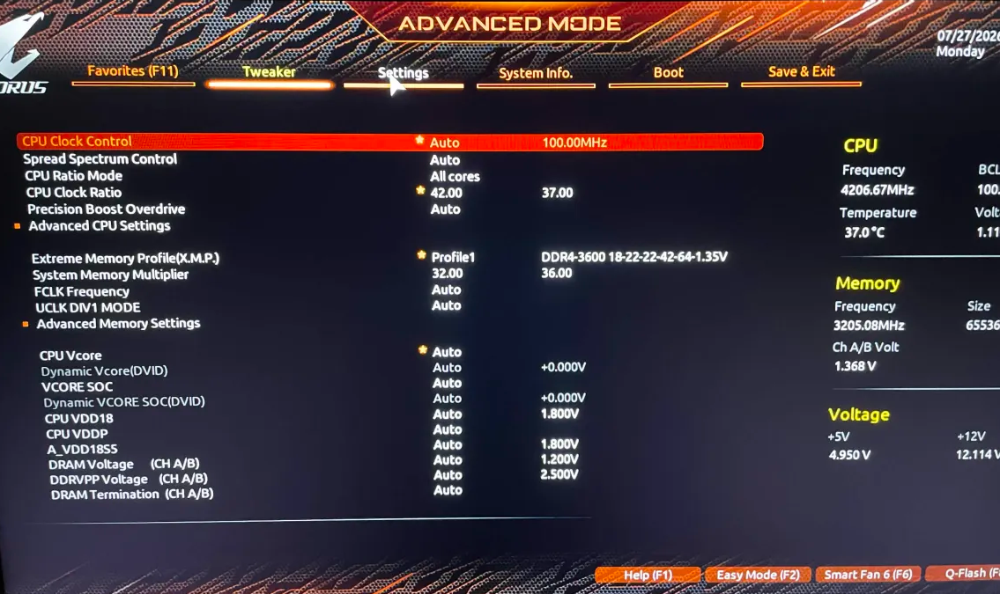<figcaption></figcaption></figure>

5.  Click **IO Ports**

    <figure>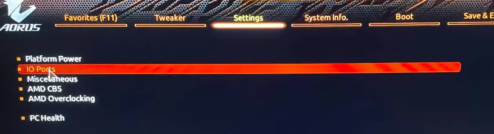<figcaption></figcaption></figure>

6.  Click **Sata Configuration** 

    <figure>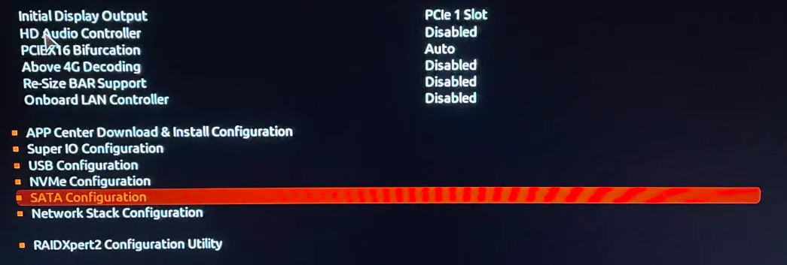<figcaption></figcaption></figure>

7.  Copy paste my settings 

    <figure>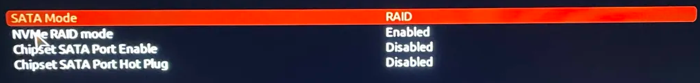<figcaption></figcaption></figure>

8. Save settings and restart PC (**First time only**)
9. Go into **BIOS again**
10. Navigate to Settings ⇒ IO Ports ⇒ You should now see **RAIDXpert2 Configuration Utility**
11. Press **Array Managment** 

    <figure>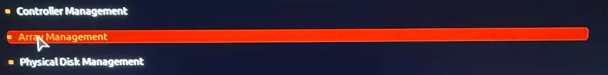<figcaption></figcaption></figure>

12. Click **Delete Array**\
    <i class="fa-wind-warning" style="color:$danger;">:wind-warning:</i> **`This will erase your files on your disks, this step should only be done when you have done all your spoofing`** 

    <figure>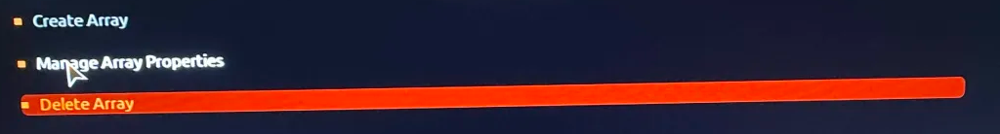<figcaption></figcaption></figure>

13. Click **Create Array** 

    <figure>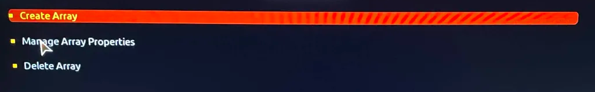<figcaption></figcaption></figure>

14. Click **Raid Level** 

    <figure>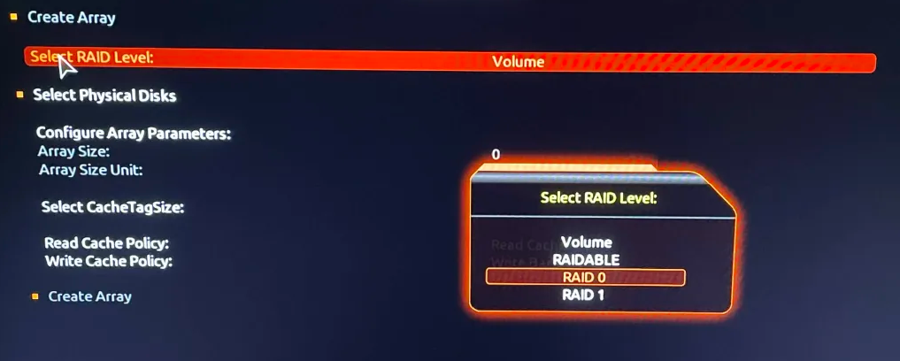<figcaption></figcaption></figure>

    \
    Use RAIDABLE for 1 DISK raid setup\
    Use RAID 0 for multiple disk setup 
15. Click **Select physical disks** 

    <figure>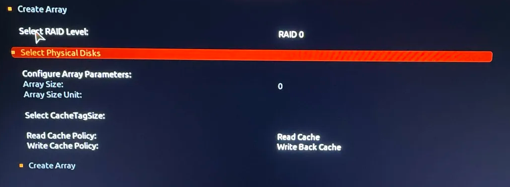<figcaption></figcaption></figure>

16. Click **Check All** 

    <figure>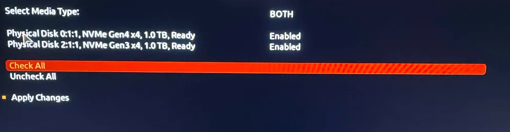<figcaption></figcaption></figure>

17. Click **Apply Changes**
18. Click **Create Array**\
     

    <figure>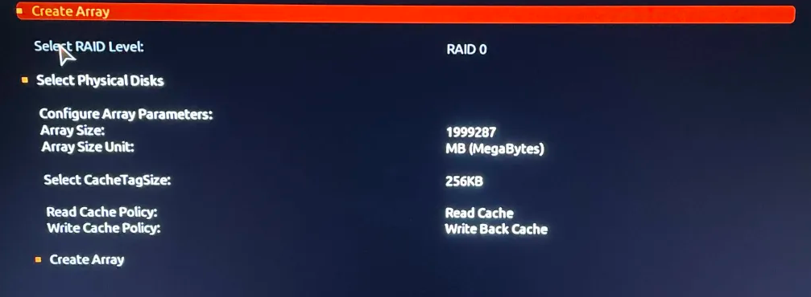<figcaption></figcaption></figure>

19. You are done with your Raid setup, nice!

***

### Installing Windows

1. Plug in your Windows USB you created
2. Restart PC
3. Hit your boot key\
   Normally F12 on Gigabyte\
   Normally F8 on ASUS, MSI
4.  Select the USB name partition 1 

    <figure><figcaption></figcaption></figure>

5.  Select your Windows language 

    <figure>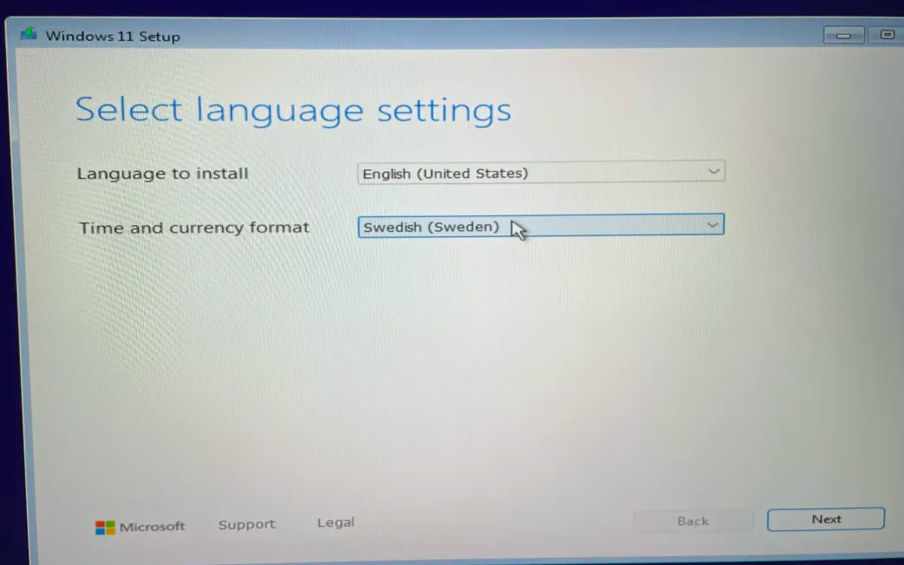<figcaption></figcaption></figure>

6.  Select keyboard input 

    <figure>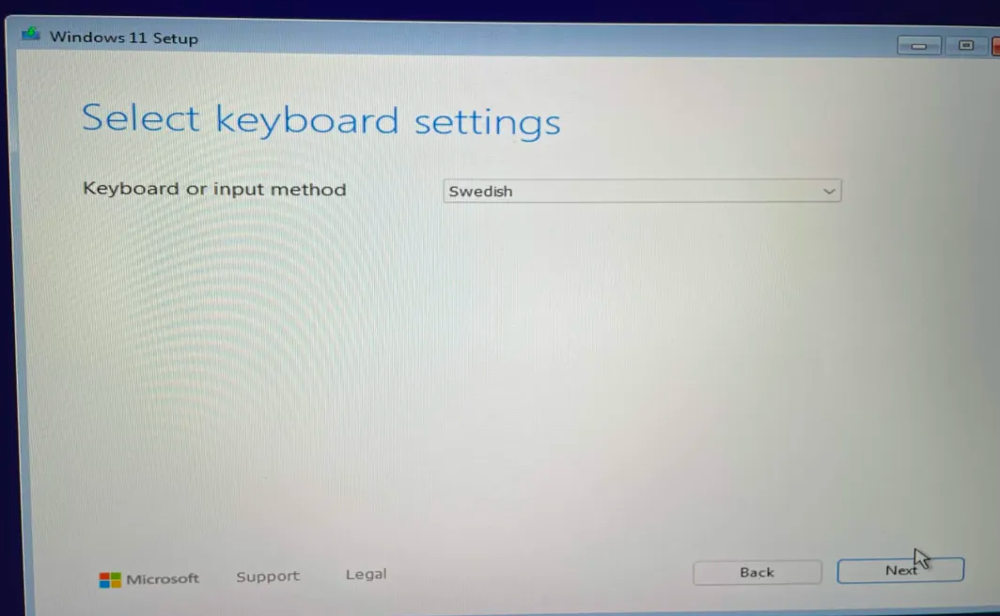<figcaption></figcaption></figure>

1.  Click **I dont have product key** 

    <figure>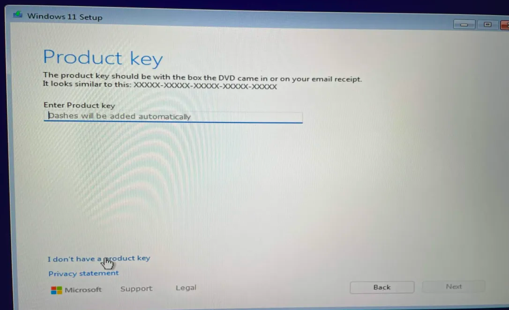<figcaption></figcaption></figure>

2.  Select first option 

    <figure><figcaption></figcaption></figure>

3.  Agree to having no privacy 

    <figure><figcaption></figcaption></figure>

4.  A preview of disks you can install Windows on, DO not select one 

    <figure><figcaption></figcaption></figure>

***

### Removing partitions (<mark style="color:$primary;">Skip if using RAID setup</mark>)

Press delete on every partition until you only have 1 Disk, 1 Partition and the full disk size is available.

<figure><figcaption></figcaption></figure>

<figure><figcaption></figcaption></figure>

^ This is how its suppose to look if you did it correctly.

***

### Loading raid driver (<mark style="color:$primary;">Skip if using spoofable NVME</mark>)

1.  Click Load Driver 

    <figure>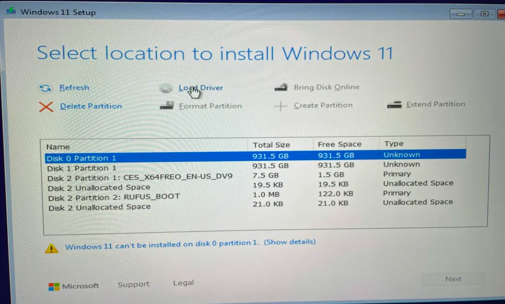<figcaption></figcaption></figure>

2.  Select the **NVME\_CC ⇒ AMD-RAID Bottom Device (rcbottom.inf)** 

    <figure><figcaption></figcaption></figure>

3. Click Load Driver
4. Accept the Terms of service shit
5.  Select **NVME\_DID** ⇒ **AMD-RAID controller \[storport] (rcraid.inf)** 

    <figure><figcaption></figcaption></figure>

6. Click Load Driver
7.  **NVME\_CC** ⇒ **AMD-RAID Config Device (rccfg.inf)** 

    <figure><figcaption></figcaption></figure>

8.  Now your raid array should show up in Windows 

    <figure><figcaption></figcaption></figure>

***

### Finishing up

1.  Install 

    <figure><figcaption></figcaption></figure>

    <figure><figcaption></figcaption></figure>


When the text appears which says "Your PC is re-starting soon" un-plug your USB to avoid leaking banned USB disk serial on your freshly installed PC.


Enjoy fresh gaming!
