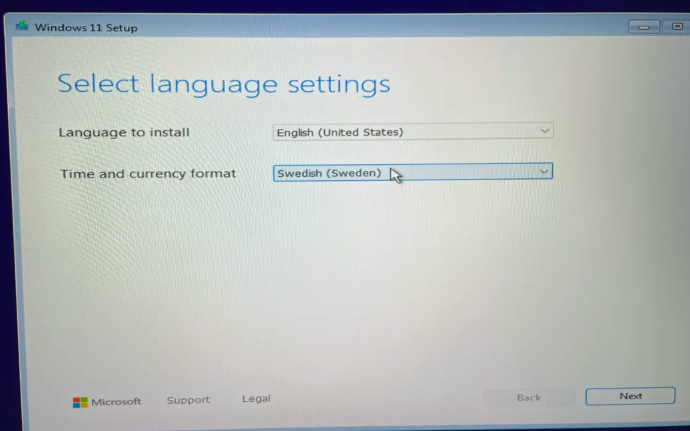
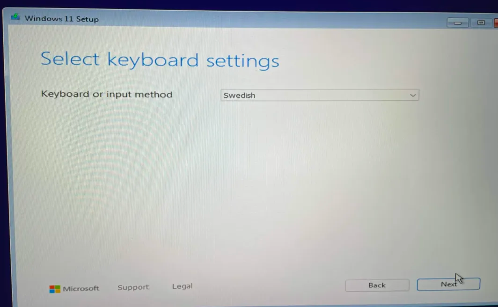
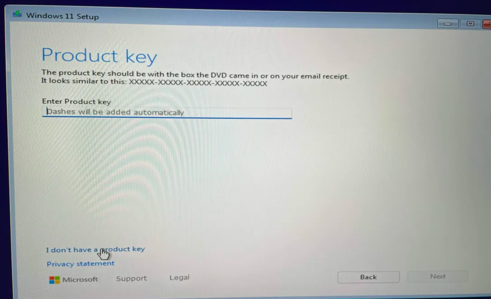

# Reinstall

### Operating system


You must have a working USB device minimum of 8GB of size


<mark style="background-color:$primary;">These ones are highly recommended to use</mark>

* [Windows 10](https://buzzheavier.com/fuxscqu93mnn) \
  Alternative here: [https://massgrave.dev/windows\_10\_links](https://massgrave.dev/windows_10_links)
* [Windows 11](https://zerofs.link/f/7ibXMho/)\
  Alternative here: [https://massgrave.dev/windows\_11\_links](https://massgrave.dev/windows_11_links)


We do no longer recommend the LTSC versions cause they come with the same Product ID


***

### Rufus

1. [Open the **Rufus** website](https://rufus.ie/).
2. Click the link to download the latest version under the “Download” section.
3. Double-click the **Rufus** executable file to launch the tool.
4. Select the flash drive to create a Windows 10/11 bootable USB drive in the “Device” section.
5.  Click the **Select** button.<br>

    <figure><figcaption></figcaption></figure>
6. Select the **Windows 10/11 ISO** file.
7. Click **Start**
8.  Check the **“Remove requirement for 4GB+ RAM, Secure Boot and TPM 2.0”** option to install version 25H2 on unsupported hardware.\
    <br>

    <figure><figcaption></figcaption></figure>
9.  Check the **“Remove requirement for an online Microsoft account”**<br>

    <figure><figcaption></figcaption></figure>
10. Select the **“Create a local account with username”** option, then specify the account name to install the operating system with a local account.\
    `user`
11. Check the **“Set regional options to the same values as this user’s”** option to use the current language as the default for new installations.
12. Check the **“Disable data collection”** option to prevent Microsoft from collecting certain data.
13. Check the **“Disable BitLocker automatic device encryption”** option.
14. Click the **OK** button.

***

## NVRAM #1 <mark style="color:$danger;">(Will Cause Issues)</mark>

**NVRAM (Non-Volatile Random-Access Memory)** is memory that can retain information even when the computer is powered off. On modern PCs, the term is commonly used for firmware-managed storage used by the UEFI/BIOS to preserve configuration and platform-specific information.

Unlike normal RAM, which loses its contents when power is removed, NVRAM is designed to retain its contents across reboots and power cycles.

#### The investigation

In my testing with EAC/Rust, leaving these variables intact consistently resulted in the previous device identity persisting across disk wipes, partition removal, and factory resets.

**Windows create multiple keys in your NVRam, some of them are:**

1. UnlockIDCopy
2. OfflineUniqueIDRandomSeed
3. OfflineUniqueIDRandomSeedCRC
4. OfflineUniqueIDEKPub (TPM related)
5. OfflineUniqueIDEKPubCRC (TPM related)
6. Boot0001-Boot0006

**ASRock has some unique keys as well:**

1. DmiVar\*-\*
2. MacAddrVar-\*

Not clearing them will result in OfflineUniqueIDRandomSeed & OfflineUniqueIDRandomSeedCRC containing unique information across factory resets, no matter if you destroy raid, format disks, remove partitions. It will stay in NVRam.

***

### NVRAM (Windows)

Requirements



* Secure boot (Temporairly disabled)
* cmd.exe as Admin ⇒ bcdedit /set TESTSIGNING ON
* Restart PC

Use our app:



Archieve password is `1`

***

### NVRAM (Linux)



### Correct steps are:

* Make sure the system is fully prepared for the new installation.
* Disconnect any storage devices that should not be involved.
* Flash bios
* Clear NVRAM
* Proceed directly with the clean installation.



### Step 1: Unplug External Storage and Remove Windows

> **Important:** Before clearing NVRAM, disconnect all storage devices that will not be used for the new installation.

Unplug or physically disconnect:

* USB flash drives
* External hard drives
* SATA SSDs/HDDs
* Additional NVMe drives
* Any other removable storage devices



### Step 2: Flashing BIOS

Download the **oldest BIOS version that supports your CPU**.

If you are unsure which version you need, you can ask an AI such as ChatGPT by providing your **motherboard model and CPU model** and asking which BIOS version is the oldest that supports your CPU.

> **VERY IMPORTANT:** Always verify the information yourself using your motherboard manufacturer's official BIOS/CPU compatibility documentation. Do not rely solely on AI-generated information.

After flashing the BIOS, your BIOS settings will be reset to their **factory defaults**. This means settings such as TPM, Secure Boot, CSM, XMP, and other options may be changed from their previous configuration.

It is therefore important to go through your BIOS settings again and configure the following:

* Disable onboard Ethernet _(not required if you are spoofing the onboard NIC)_
* Disable Bluetooth/Wi-Fi
* Disable TPM
* Disable Security Device
* Disable onboard audio
* Disable onboard graphics _(if your CPU has integrated graphics)_
* Enable XMP and configure any desired overclocking settings
* Disable CSM
* Enable Secure Boot
* Set Secure Boot mode to **Custom**
* Restore the factory Secure Boot keys
* Save your changes and restart the PC



### Step 3: **Creating Linux bootable USB**

I will not share the detail of creating the USB, however I was using Ubuntu 22.04 LTS for these commands



### Step 4: Removing Windows / Partitions

[reinstall.md](reinstall.md "mention")

* Pick a windows from the guide
* Create the USB (If using NVME enclosure follow this: [sabrent-ec-svne.md](../disk-spoofing/sabrent-ec-svne.md "mention")
* Follow **#Removing partitions** (If using NVME enclosure follow this: [sabrent-ec-svne.md](../disk-spoofing/sabrent-ec-svne.md "mention")



### Step 5: Clearing NVRam

> **IMPORTANT:** Do **not** boot into Windows after clearing NVRAM.\
> \
> Clearing NVRAM should be performed as the **final step**, after you have completed all other required changes.
>
> If you remove EFI variables or make BIOS changes and then boot into Windows afterward, Windows or the firmware may recreate or modify certain configuration data.


**1. Boot into Linux**

Plug in the Linux USB you created earlier and boot the PC from it.

Become root:

```shellscript
sudo su
```

**2. List the EFI variables**

```shellscript
ls /sys/firmware/efi/efivars/
```

**3. Read the variables**

If you want to inspect the variables before making any changes, you can use:

```shellscript
sudo xxd /sys/firmware/efi/efivars/OfflineUniqueIDRandomSeed-*
sudo xxd /sys/firmware/efi/efivars/OfflineUniqueIDRandomSeedCRC-*
sudo xxd /sys/firmware/efi/efivars/UnlockIDCopy-*
sudo xxd /sys/firmware/efi/efivars/OfflineUniqueIDEKPubCRC-*
sudo xxd /sys/firmware/efi/efivars/MacAddrVar-*
```

To inspect the relevant `Boot` variables:

```shellscript
for f in /sys/firmware/efi/efivars/Boot000[1-6]-*; do
    echo "==== $f ===="
    sudo xxd "$f"
    echo
done
```

To inspect the `DmiVar` variables:

```shellscript
for f in /sys/firmware/efi/efivars/DmiVar-*; do
    echo "==== $f ===="
    sudo xxd "$f"
    echo
done
```

**4. Remove the Linux immutable attribute**

Some EFI variables may have the Linux immutable (`i`) attribute set. Remove it before attempting to delete the variables:

```shellscript
sudo chattr -i /sys/firmware/efi/efivars/OfflineUniqueIDRandomSeed-*
sudo chattr -i /sys/firmware/efi/efivars/OfflineUniqueIDRandomSeedCRC-*
sudo chattr -i /sys/firmware/efi/efivars/UnlockIDCopy-*
sudo chattr -i /sys/firmware/efi/efivars/OfflineUniqueIDEKPubCRC-*
sudo chattr -i /sys/firmware/efi/efivars/MacAddrVar-*
```

For the `Boot` variables:

```shellscript
for f in /sys/firmware/efi/efivars/Boot000[1-6]-*; do
    echo "==== $f ===="
    sudo chattr -i "$f"
    echo
done
```

For the `DmiVar` variables:

```shellscript
for f in /sys/firmware/efi/efivars/DmiVar-*; do
    echo "==== $f ===="
    sudo chattr -i "$f"
    echo "done"
done
```

**5. Remove the selected EFI variables**

```shellscript
sudo rm /sys/firmware/efi/efivars/OfflineUniqueIDRandomSeed-*
sudo rm /sys/firmware/efi/efivars/OfflineUniqueIDRandomSeedCRC-*
sudo rm /sys/firmware/efi/efivars/UnlockIDCopy-*
sudo rm /sys/firmware/efi/efivars/OfflineUniqueIDEKPubCRC-*
sudo rm /sys/firmware/efi/efivars/MacAddrVar-*
```

Remove the selected `Boot` variables:

```shellscript
for f in /sys/firmware/efi/efivars/Boot000[1-6]-*; do
    echo "==== $f ===="
    sudo rm "$f"
    echo
done
```

Remove the selected `DmiVar` variables:

```shellscript
for f in /sys/firmware/efi/efivars/DmiVar-*; do
    echo "==== $f ===="
    sudo rm "$f"
    echo "done"
done
```

> **WARNING:** EFI variables are firmware configuration data. Deleting the wrong variables can affect boot configuration or other firmware functionality. Only remove variables that you have verified are safe to remove for your specific motherboard/firmware.

**6. Shut down the PC**

When you are finished, disconnect all removable storage:

* **Unplug all USB flash drives**, including the Linux USB.
* **Disconnect any storage devices that should not be present during the installation.**

Then shut down the system:

```shellscript
shutdown -h now
```



### Final step

Do **not** boot back into Windows at this point.

Only power the PC back on when you are ready to proceed with the intended installation.

> **Do not flash the BIOS again after clearing the EFI variables**, unless you have a specific reason to do so. A BIOS flash can reset or recreate firmware variables and therefore changes the state you just configured.



***

### Installing Windows

1. Plug in your Windows USB you created
2. Restart PC
3. Hit your boot key\
   Normally F12 on Gigabyte\
   Normally F8 on ASUS, MSI
4.  Select the USB name partition 1<br>

    <figure><figcaption></figcaption></figure>


5.  Select your Windows language<br>

    <figure><figcaption></figcaption></figure>


6.  Select keyboard input<br>

    <figure><figcaption></figcaption></figure>


1.  Click **I dont have product key**<br>

    <figure><figcaption></figcaption></figure>


2.  Select first option<br>

    <figure><figcaption></figcaption></figure>


3.  Agree to having no privacy<br>

    <figure><figcaption></figcaption></figure>


***

### Removing partitions

Press delete on every partition until you only have 1 Disk, 1 Partition and the full disk size is available.

<figure><figcaption></figcaption></figure>

<figure><figcaption></figcaption></figure>

^ This is how its suppose to look if you did it correctly.

***

### Finishing up

1.  Install<br>

    <figure><figcaption></figcaption></figure>

    <figure><figcaption></figcaption></figure>


When the text appears which says "Your PC is re-starting soon" un-plug your USB to avoid leaking banned USB disk serial on your freshly installed PC.


Enjoy fresh gaming!
